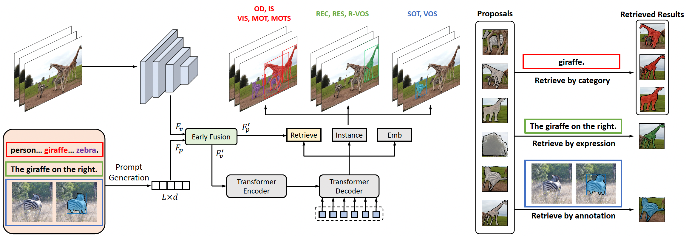
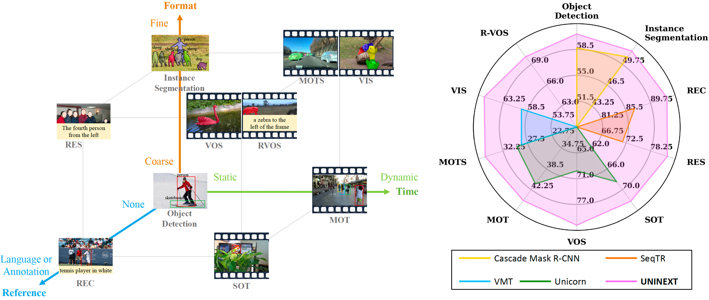
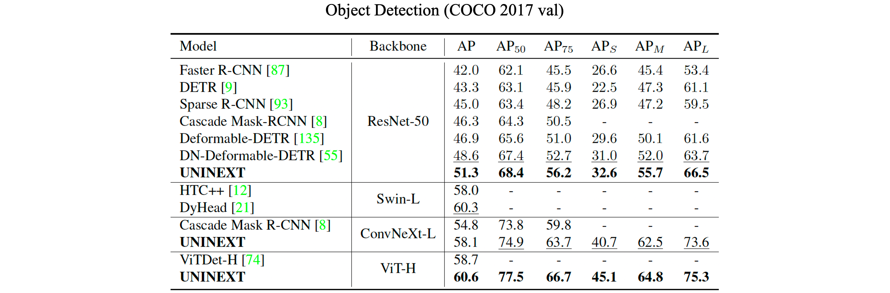
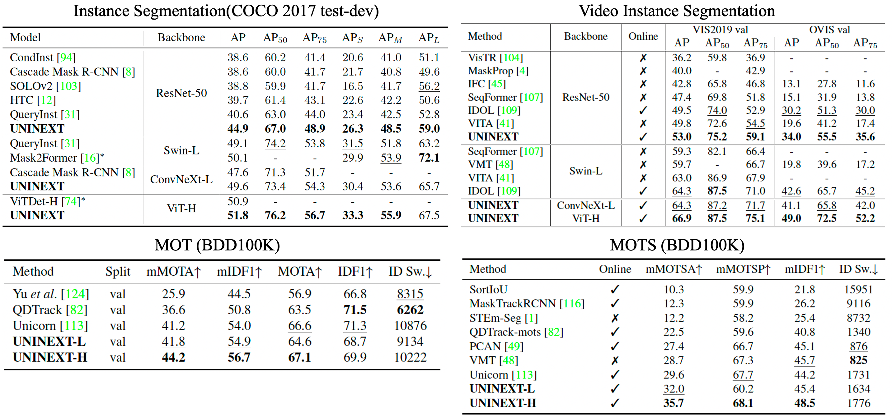
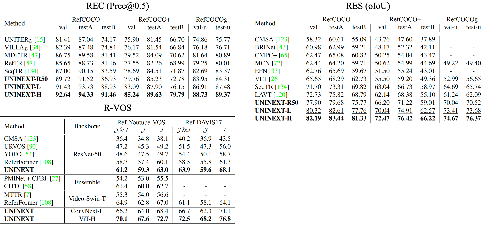
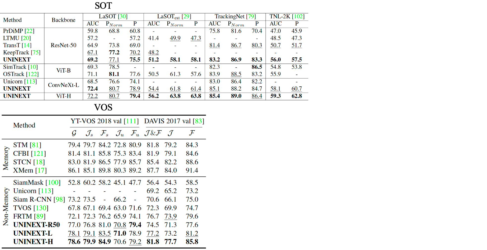

# Universal Instance Perception as Object Discovery and Retrieval

This is the official implementation of the paper [Universal Instance Perception as Object Discovery and Retrieval](https://arxiv.org/abs/2303.06674).

[](https://paperswithcode.com/sota/visual-object-tracking-on-lasot-ext?p=universal-instance-perception-as-object)
[](https://paperswithcode.com/sota/visual-object-tracking-on-lasot?p=universal-instance-perception-as-object)
[](https://paperswithcode.com/sota/visual-tracking-on-tnl2k?p=universal-instance-perception-as-object)
[](https://paperswithcode.com/sota/visual-object-tracking-on-trackingnet?p=universal-instance-perception-as-object)
[](https://paperswithcode.com/sota/multi-object-tracking-and-segmentation-on-3?p=universal-instance-perception-as-object)
[](https://paperswithcode.com/sota/multiple-object-tracking-on-bdd100k-val?p=universal-instance-perception-as-object)
[](https://paperswithcode.com/sota/video-instance-segmentation-on-youtube-vis-1?p=universal-instance-perception-as-object)
[](https://paperswithcode.com/sota/video-instance-segmentation-on-ovis-1?p=universal-instance-perception-as-object)
[](https://paperswithcode.com/sota/referring-expression-segmentation-on-refer-1?p=universal-instance-perception-as-object)
[](https://paperswithcode.com/sota/referring-expression-segmentation-on-davis?p=universal-instance-perception-as-object)
[](https://paperswithcode.com/sota/referring-expression-segmentation-on-refcoco?p=universal-instance-perception-as-object)
[](https://paperswithcode.com/sota/referring-expression-segmentation-on-refcoco-3?p=universal-instance-perception-as-object)
[](https://paperswithcode.com/sota/referring-expression-comprehension-on-refcoco?p=universal-instance-perception-as-object)
[](https://paperswithcode.com/sota/referring-expression-comprehension-on?p=universal-instance-perception-as-object)
[](https://paperswithcode.com/sota/referring-expression-comprehension-on-refcoco-1?p=universal-instance-perception-as-object)
## Highlight
- UNINEXT is accepted by **CVPR2023**.
- UNINEXT reformulates diverse instance perception tasks into **a unified object discovery and retrieval paradigm** and can flexibly perceive different types of objects by simply changing the input prompts.
- UNINEXT achieves **superior performance on 20 challenging benchmarks using a single model with the same model parameters**. 

## Introduction



Object-centric understanding is one of the most essential and challenging problems in computer vision. In this work, we mainly discuss 10 sub-tasks, distributed on the vertices of the cube shown in the above figure. Since all these tasks aim to perceive instances of certain properties, UNINEXT reorganizes them into three types according to the different input prompts:
- Category Names
  - Object Detection
  - Instance Segmentation
  - Multiple Object Tracking (MOT)
  - Multi-Object Tracking and Segmentation (MOTS)
  - Video Instance Segmentation (VIS)
-  Language Expressions
    - Referring Expression Comprehension (REC)
    - Referring Expression Segmentation (RES)
    - Referring Video Object Segmentation (R-VOS)
- Target Annotations
    - Single Object Tracking (SOT)
    - Video Object Segmentation (VOS)

Then we propose a unified prompt-guided object discovery and retrieval formulation
to solve all the above tasks. Extensive
experiments demonstrate that UNINEXT achieves superior performance on 20 challenging benchmarks.

## Demo
https://user-images.githubusercontent.com/40926230/224527028-f31e8de0-b8aa-4cfb-a83b-63a70ff5bd52.mp4

UNINEXT can flexibly perceive various types of objects by simply changing the input prompts, such as category names, language expressions, and target annotations. We also provide a simple [demo script](assets/demo.sh), which supports 4 image-level tasks (object detection, instance segmentation, REC, RES).

## Results
### Retrieval by Category Names


### Retrieval by Language Expressions

### Retrieval by Target Annotations


## Getting started
1. Installation: Please refer to [INSTALL.md](assets/INSTALL.md) for more details.
2. Data preparation: Please refer to [DATA.md](assets/DATA.md) for more details.
3. Training: Please refer to [TRAIN.md](assets/TRAIN.md) for more details.
4. Testing: Please refer to [TEST.md](assets/TEST.md) for more details. 
5. Model zoo: Please refer to [MODEL_ZOO.md](assets/MODEL_ZOO.md) for more details.

## Citing UNINEXT
If you find UNINEXT useful in your research, please consider citing:
```bibtex
@inproceedings{UNINEXT,
  title={Universal Instance Perception as Object Discovery and Retrieval},
  author={Yan, Bin and Jiang, Yi and Wu, Jiannan and Wang, Dong and Yuan, Zehuan and Luo, Ping and Lu, Huchuan},
  booktitle={CVPR},
  year={2023}
}
```

## Acknowledgments
- Thanks [Unicorn](https://github.com/MasterBin-IIAU/Unicorn) for providing experience of unifying four object tracking tasks (SOT, MOT, VOS, MOTS).
- Thanks [VNext](https://github.com/wjf5203/VNext) for providing experience of Video Instance Segmentation (VIS).
- Thanks [ReferFormer](https://github.com/wjn922/ReferFormer) for providing experience of REC, RES, and R-VOS.
- Thanks [GLIP](https://github.com/microsoft/GLIP) for the idea of unifying object detection and phrase grounding.
- Thanks [Detic](https://github.com/facebookresearch/Detic) for the implementation of multi-dataset training.
- Thanks [detrex](https://github.com/IDEA-Research/detrex) for the implementation of denoising mechnism.
